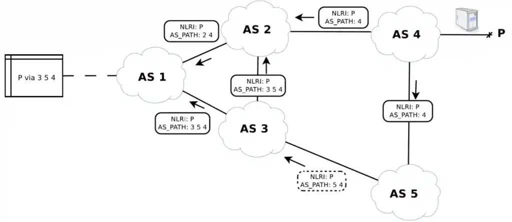

# BGP
**Sources:** [1][bgp-1],  
Border Gateway Protocol (BGP) is a standardized exterior gateway protocol designed to exchange routing and reachability information among autonomous systems (AS)[1][ext-1] on the Internet. BGP is classified as a path-vector routing protocol, and it makes routing decisions based on paths, network policies, or rule-sets configured by a network administrator.

### History
BGP was first described in 1989 in RFC 1105, and has been in use on the Internet since 1994.  
IPv6 BGP was first defined in [RFC 1883][rfc-1883] in 1995, and it was improved to [RFC 2283][rfc-2283] in 1998.  
The current version of BGP is version 4 (BGP4), which was published as RFC 4271 in 2006.  
* [RFC 4271][rfc-4271] - corrected errors, clarified ambiguities and updated the specification with common industry practices. 
  * The major enhancement was the support for CIDR and use of route aggregation to decrease the size of routing tables.
* Allows BGP4 to carry a wide range of IPv4 and IPv6 "address families".
* Also called Multiprotocol Extensions which is Multiprotocol BGP (MP-BGP).

### How does this impact Routing?
BGP is the protocol that helps to determine & update routes between internet gateway routers.  
BGP is basically what determines the routes across the internet, so it heavily impacts routing.  

There are 2 flavors of BGP.
1. **iBGP** - Used for routing within an autonomous system (ASN)
2. **eBGP** - Used for routing across the Internet.

### Vulnerablities
**Sources:** [1][vuln-1], [2][vuln-2],  

The risks in BGP arise from three fundamental vulnerabilities:

1. BGP has no internal mechanism that provides strong protection of the integrity, freshness, and peer entity authenticity of the messages in peer-peer BGP communications.
2. No mechanism has been specified within BGP to validate the authority of an AS to announce NLRI information.
3. No mechanism has been specified within BGP to ensure the authenticity of the path attributes announced by an AS.

Despite all its good qualities, BGP shows several vulnerabilities which, if exploited, can cause ripple effects all over the Internet. The root of the problem is that BGP was conceived in an early development stage of the Internet when there were only a few players. Consequently, its design didn’t consider protection against deliberate or accidental errors, so malicious or misconfigured sources can potentially propagate fake routing information all over the Internet, exploiting this lack of protection. Even worse, the source of fake or malicious routing information could be either a real BGP peer or a fake peer, since BGP runs on TCP/IP and is consequently subject to every classic TCP/IP attack such as IP spoofing.  

Part of the problem can be solved applying cryptographic authentication on each BGP peer, but this won’t help stop bogus information spreading all over the Internet from legitimate misconfigured sources (route leaks), from legitimate sources which either didn’t apply cryptographic authentication at all, or from sources that deliberately announced bogus routing information (prefix hijacks).  

Solutions like Resource Public Key Infrastructure (RPKI) and BGPsec path validation have been recently standardized by IETF, but they still require the collaboration of many AS’s and thus are difficult to deploy.

#### Prefix Hijack Attacks
Prefix hijacks are deliberate intentional generation of bogus routing information.

The attacker could announce routes to disrupt the services running on top of the IP space covered by the routes, or hijack the traffic to analyze confidential information flowing towards that service. The attacker could also simply announce routes with a crafted AS path to show fake neighboring connections in famous websites, like the BGP toolkit of Hurricane Electric. Or even worse, the attacker could hijack the traffic to manipulate the flowing packets at his/her will, or simply want to exploit unused routes to generate spam.

**Example: (Above)**  
AS 5 is a malicious attacker and is connected to the Internet via two providers: AS 2 and AS 3.  
AS 1 is customer of AS 2 and provider of AS 3, while AS 4 is a peer of AS 2 and AS 2 is provider of AS 3.  
Finally, we assume that AS 2 has properly set its incoming BGP filters, while AS 1 and AS 3 have a loose filter configuration (if any).

In this scenario, AS 5 will announce network P, which is owned and already announced by AS 4.  
Due to the filter configurations described above, the Update message announced by AS 5 will be dropped by AS 2, while it will be accepted by AS 3.  
AS 3 will then announce that to its providers (AS 1 and AS 2).  
AS 2 will again drop the packet due to the filters, while AS 1 will accept it.  
If the BGP decision process of AS 1 will select as best route the path from AS 5, then traffic from AS 1 to AS 5 will be sent to the attacker instead of towards the proper owner.

##### Solution

#### Route Leaks and Fat Finger Syndrome
Route leaks are unintentional generation of bogus routing information caused by router misconfigurations, such as typos in the filter configuration or mis-origination of someone’s else network (fat finger). Even if unintentional, the consequences of a route leak can be the same as the prefix hijacks.

Consider the very same topology we used in the prefix hijack examples, with the difference that AS 5 is now a normal network operator which simply applied wrong BGP filters, such as “accept everything from my provider, announce everything to my provider.” This is sadly not an uncommon case, and it is an error that several AS’s can do when switching from a single provider (where this rule works fine) to multiple providers (where this rule would make the AS a transit of each provider).

##### Solution

[bgp-1]: https://en.wikipedia.org/wiki/Border_Gateway_Protocol
[bgp-2]: https://blog.catchpoint.com/2019/10/25/vulnerabilities-of-bgp/

[vuln-1]: https://tools.ietf.org/html/rfc4271
[vuln-x]: https://www.blackhat.com/presentations/bh-usa-03/bh-us-03-convery-franz-v3.pdf

[rfc-4271]: https://tools.ietf.org/html/rfc4271
[rfc-2283]: https://tools.ietf.org/html/rfc2283
[rfc-1883]: https://tools.ietf.org/html/rfc1883

[ext-1]: ASNs.md
