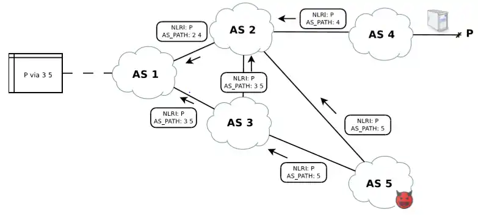
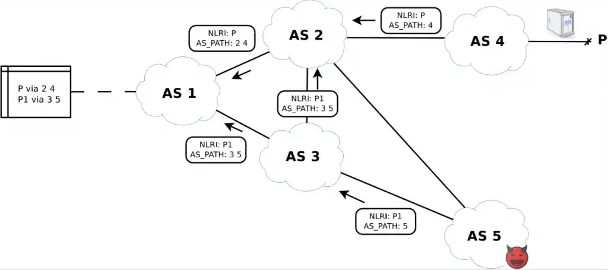
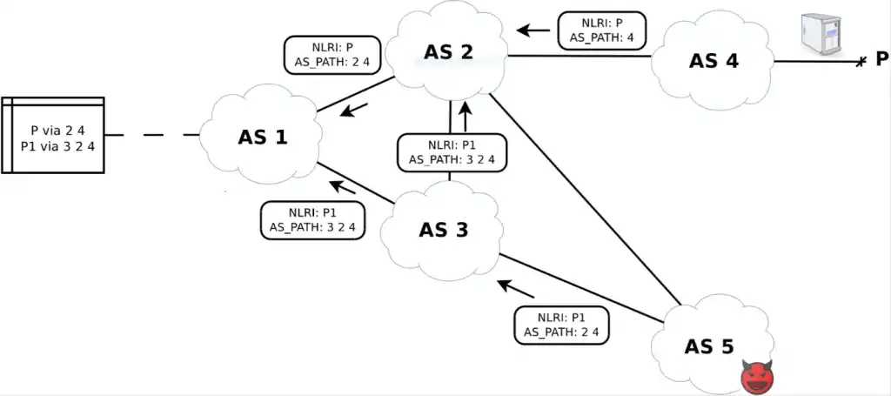

# BGP
**Sources:** [1][bgp-1],  
Border Gateway Protocol (BGP) is a standardized exterior gateway protocol designed to exchange routing and reachability information among autonomous systems (AS) [1][ext-1] on the Internet. BGP is classified as a path-vector routing protocol, and it makes routing decisions based on paths, network policies, or rule-sets configured by a network administrator.

### History
BGP was first described in 1989 in RFC 1105, and has been in use on the Internet since 1994.  
IPv6 BGP was first defined in RFC 1883 in 1995, and it was improved to RFC 2283 in 1998.  
The current version of BGP is version 4 (BGP4), which was published as RFC 4271 in 2006.  
* [RFC 1883][rfc-1883] - 
* [RFC 2283][rfc-2283] - 
* [RFC 4271][rfc-4271] - Corrected errors, clarified ambiguities and updated the specification with common industry practices. 
* [RFC 4272][vuln-1] - 
  * The major enhancement was the support for CIDR and use of route aggregation to decrease the size of routing tables.
* Allows BGP4 to carry a wide range of IPv4 and IPv6 "address families".
* Also called Multiprotocol Extensions which is Multiprotocol BGP (MP-BGP).

### How does this impact Routing?
BGP is the protocol that helps to determine & update routes between internet gateway routers.  
BGP is basically what determines the routes across the internet, so it heavily impacts routing.  

There are 2 flavors of BGP.
1. **iBGP** - Used for routing within an autonomous system (ASN)
2. **eBGP** - Used for routing across the Internet.

### Vulnerablities
**Sources:** [1][vuln-1], 

The risks in BGP arise from three fundamental vulnerabilities:

1. BGP has no internal mechanism that provides strong protection of the integrity, freshness, and peer entity authenticity of the messages in peer-peer BGP communications.
2. No mechanism has been specified within BGP to validate the authority of an AS to announce NLRI information.
3. No mechanism has been specified within BGP to ensure the authenticity of the path attributes announced by an AS.

Despite all its good qualities, BGP shows several vulnerabilities which, if exploited, can cause ripple effects all over the Internet. The root of the problem is that BGP was conceived in an early development stage of the Internet when there were only a few players. Consequently, its design didn’t consider protection against deliberate or accidental errors, so malicious or misconfigured sources can potentially propagate fake routing information all over the Internet, exploiting this lack of protection. Even worse, the source of fake or malicious routing information could be either a real BGP peer or a fake peer, since BGP runs on TCP/IP and is consequently subject to every classic TCP/IP attack such as IP spoofing.  

Part of the problem can be solved applying cryptographic authentication on each BGP peer, but this won’t help stop bogus information spreading all over the Internet from legitimate misconfigured sources (route leaks), from legitimate sources which either didn’t apply cryptographic authentication at all, or from sources that deliberately announced bogus routing information (prefix hijacks).  

Solutions like Resource Public Key Infrastructure (RPKI) and BGPsec path validation have been recently standardized by IETF, but they still require the collaboration of many AS’s and thus are difficult to deploy.

#### Prefix Hijack Attacks
Prefix hijacks are deliberate intentional generation of bogus routing information.

The attacker could announce routes to disrupt the services running on top of the IP space covered by the routes, or hijack the traffic to analyze confidential information flowing towards that service. The attacker could also simply announce routes with a crafted AS path to show fake neighboring connections in famous websites, like the BGP toolkit of Hurricane Electric. Or even worse, the attacker could hijack the traffic to manipulate the flowing packets at his/her will, or simply want to exploit unused routes to generate spam.

**Example 1: (Above)**  
AS 5 is a malicious attacker and is connected to the Internet via two providers: AS 2 and AS 3. AS 1 is customer of AS 2 and provider of AS 3, while AS 4 is a peer of AS 2 and AS 2 is provider of AS 3. Finally, we assume that AS 2 has properly set its incoming BGP filters, while AS 1 and AS 3 have a loose filter configuration (if any).  

In this scenario, AS 5 will announce network P, which is owned and already announced by AS 4. Due to the filter configurations described above, the Update message announced by AS 5 will be dropped by AS 2, while it will be accepted by AS 3. AS 3 will then announce that to its providers (AS 1 and AS 2). AS 2 will again drop the packet due to the filters, while AS 1 will accept it. If the BGP decision process of AS 1 will select as best route the path from AS 5, then traffic from AS 1 to AS 5 will be sent to the attacker instead of towards the proper owner.  

Now imagine this to include about 65,000 AS’s, each with its own filter policy, if any. The consequence is that part of the Internet will redirect its traffic towards the attacker, while the rest will redirect its traffic towards the proper origin.  

The amount of AS’s redirecting their traffic towards the attacker will depend on two factors:  
1. The quality of the filters applied by the providers.  
2. The BGP decision process output of each AS.  

**Note**  
In this scenario it is possible to identify the attacker.  
By checking BGP packets involving P, either from route collectors via post-mortem analysis Or from dedicated real-time BGP monitoring systems, or customer complaints, when traffic is not re-directed to the original owner.

**Example 2: (Above)**  

AS 5 will now announce network P1 subnet of network P, still owned by AS 4 but never advertised by AS 4. For example, consider P to be 10.0.0.0/23, then P1 could either be 10.0.0.0/24 or 10.0.1.0/24. AS 5 will announce it only to AS 3, knowing that AS 3 filters are loose. In addition, AS 5 will know that AS 2’s filters are tight and will exploit that to keep a safe route towards the destination.

In this scenario, P1 will propagate the same way as P in the previous scenario. The slight difference is that now every affected AS will have two different routes for the IP space covered by P: P and P1. Let’s focus on AS 1. Even if a proper route to P is installed in AS 1’s router, only a portion of traffic of the original P will be directed to the proper owner due to the longest prefix match. Please note that since AS 5 kept one of its providers explicitly out of the hijack, AS 5 can now route traffic received from AS 1 directed to P1 to the proper owner, after analyzing and/or manipulating each packet.

Now consider again this real-world example and imagine that AS 4 is hosting on P1 some servers of a bank. Consider now that the attacker is interested in collecting data from the bank, and that he/she studied the problem deeply enough to know that P1 is the ideal target for its purposes and starts announcing it.Differently from the previous scenario, the bogus routing information spread will now depend only on the quality of the filters applied by AS’s, since the subnet P1 and P will not interfere with each other in BGP decision processes. As soon as everything is set up, then AS 5 will be able to receive data from the affected portion of the world, while keeping a safe routing leg to forward traffic and (hopefully for him/her) get unnoticed.

Again, note that in this scenario it is still possible to identify the attacker by checking BGP packets involving P and any subnet of P either from route collectors or via dedicated real-time BGP monitoring systems. However, the network operator can’t identify the attack from the complaints received by his/her customers if the delay introduced by the attacker is short enough to go unnoticed.

An example of a route leak which falls perfectly in this scenario is the infamous hijack of YouTube prefixes by Pakistan Telecom back in late February 2008. In that case, Pakistan Telecom attempted to blackhole traffic towards 208.65.153.0/24 by announcing routes where Pakistan Telecom was appearing as the origin AS to fulfill a censorship request from the Pakistan government. The problem is that they also announced this route to its provider PCCW, which didn’t apply proper filters and caused a domino effect, causing about 3 hours of service disruption to YouTube.

Consider now the above scenario. AS 5 is now smart enough to forge a fake AS path in the Update message by keeping the AS of the real owner at the end of the AS path as well as the original provider of the real owner (AS 2).

The propagation of the attack is the same as the previous examples, but now the detection of the attack is much harder. It is still possible to check BGP packets involving P and any subnet of P either from route collectors or via dedicated real-time BGP monitoring systems, but now the detection of the attack must also rely on additional pieces of information, such as the knowledge of each relationship between each pair of AS’s in the AS path. Indeed, in this example it would have been possible to detect that since AS 3 is customer of AS 2, and the AS path 3 2 4 detected at AS 1 would have shown the involvement of AS 3 as transit of AS 2 for P1, which is against the valley-free property.

#### Route Leaks and Fat Finger Syndrome
Route leaks are unintentional generation of bogus routing information caused by router misconfigurations, such as typos in the filter configuration or mis-origination of someone’s else network (fat finger). Even if unintentional, the consequences of a route leak can be the same as the prefix hijacks.

Consider the very same topology we used in the prefix hijack examples, with the difference that AS 5 is now a normal network operator which simply applied wrong BGP filters, such as “accept everything from my provider, announce everything to my provider.” This is sadly not an uncommon case, and it is an error that several AS’s can do when switching from a single provider (where this rule works fine) to multiple providers (where this rule would make the AS a transit of each provider).

Due to that mistake, now AS 5 will propagate everything it receive from its provider towards another provider, clearly against the valley-free property. This piece of routing information will then spread all over the Internet and AS’s will start routing traffic depending on the result of the BGP decision process of each AS.

Now think again about the 65,000 AS’s in the Internet and imagine that AS 4 is a rural service provider with few resources, both technical and economic. This would mean that probably the upstream connection he/she bought from his/her providers is very limited, thus making the two links a bottleneck in this route leak scenario. In this case it is possible that AS 5 will not be able to handle the amount of traffic directed to P, causing not only an additional delay, but also several packet losses.

This was the case of the route leak we discussed in our June blog, which affected several banks in addition to Facebook and CloudFlare. This wasn’t the only case of route leak recently experienced, and thanks to that IETF managed to draw a remarkable route leak classification.

[bgp-1]: https://en.wikipedia.org/wiki/Border_Gateway_Protocol
[bgp-2]: https://blog.catchpoint.com/2019/10/25/vulnerabilities-of-bgp/

[vuln-1]: https://tools.ietf.org/html/rfc4272
[vuln-x]: https://www.blackhat.com/presentations/bh-usa-03/bh-us-03-convery-franz-v3.pdf

[rfc-4271]: https://tools.ietf.org/html/rfc4271
[rfc-2283]: https://tools.ietf.org/html/rfc2283
[rfc-1883]: https://tools.ietf.org/html/rfc1883

[ext-1]: ASNs.md
